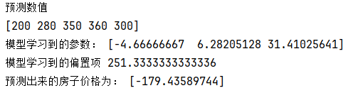

第 1 天：机器学习整体认知
今天的目标不是马上学复杂算法，而是先把机器学习最核心的几个概念搞清楚：
数据是什么？
特征是什么？
标签是什么？
模型学的是什么？
训练和预测分别在做什么？
你只要把这些概念理解透，后面学习线性回归、逻辑回归、决策树、随机森林、深度学习都会顺很多。
一、今日学习目标

今天需要掌握 5 件事：
理解什么是机器学习；
区分监督学习、无监督学习、强化学习；
区分分类任务和回归任务；
理解特征 X、标签 y、模型 model 的含义；
跑通一个最简单的机器学习预测流程。
二、什么是机器学习？

传统编程是：
人写规则 + 输入数据 = 输出结果
例如：

if score >= 60:
    print("及格")
else:
    print("不及格")

这里规则是人写死的。

机器学习是：

输入数据 + 正确答案 = 让模型自己学习规则

例如你给模型很多房子数据：

面积    房间数    楼层    房价
80     2        10      200万
100    3        15      280万
120    3        20      350万

模型会尝试从这些数据中学习规律：

面积越大，房价可能越高；
房间数越多，房价可能越高；
楼层不同，房价也可能不同。

所以，机器学习不是让电脑死记硬背答案，而是让电脑从数据中找到规律。

三、机器学习中的核心概念
1. 样本

一条数据就是一个样本。

例如：

面积=100，房间数=3，楼层=15，房价=280万

这就是一个样本。

2. 特征 X

特征就是用来预测结果的输入信息。

例如预测房价时：

面积、房间数、楼层

这些就是特征。

在代码中通常写作：

X = [
    [80, 2, 10],
    [100, 3, 15],
    [120, 3, 20]
]

你可以理解为：

X 是模型看到的题目条件。
3. 标签 y

标签就是正确答案。
例如：
房价
在代码中通常写作：
y = [200, 280, 350]
你可以理解为：
y 是模型学习时参考的标准答案。
4. 模型 model
模型就是用来学习规律的工具。
例如：
线性回归模型
逻辑回归模型
决策树模型
随机森林模型
神经网络模型

你可以暂时把模型理解成一个函数：
输入 X，输出预测结果
例如：
输入：面积=90，房间数=2，楼层=12
输出：预测房价=240万
5. 训练 train
训练就是让模型从已有数据中学习规律。
model.fit(X_train, y_train)
这句话的含义是：

把训练数据 X_train 和正确答案 y_train 交给模型，让模型学习它们之间的关系。
6. 预测 predict

预测就是把新的数据交给模型，让模型给出结果。
model.predict(X_test)

这句话的含义是：
模型已经学完了，现在给它新样本，让它预测答案。
四、监督学习、无监督学习、强化学习
1. 监督学习

监督学习就是数据中有标准答案。

例如：

图片 → 猫/狗
文本 → 好评/差评
面积、房间数、楼层 → 房价
用户信息 → 是否会购买
监督学习的核心是：
模型一边看题目，一边看答案，然后学习题目和答案之间的关系。
大部分入门机器学习都从监督学习开始。

2. 无监督学习

无监督学习就是数据中没有标准答案。
例如你有一批用户数据：
用户A：消费高，购买频繁
用户B：消费低，很久没买
用户C：消费中等，经常浏览

但是你没有告诉模型谁是高价值用户，谁是低价值用户。

模型需要自己把相似的用户分到一组。

典型任务是：

聚类
降维
异常检测
3. 强化学习

强化学习更像是让智能体通过试错学习。

例如：

机器人走路
游戏 AI
自动驾驶
围棋 AI

它的核心是：

做一个动作 → 得到奖励或惩罚 → 调整策略 → 下次做得更好。

五、分类和回归的区别

机器学习中最常见的两类任务是：分类和回归。

1. 分类任务

分类任务预测的是类别。
例如：

邮件是否为垃圾邮件：是 / 否
图片是猫还是狗：猫 / 狗
评论是好评还是差评：好评 / 差评
用户是否会流失：流失 / 不流失
输出结果通常是离散的类别。

例如：
0、1
猫、狗
好评、差评
正常、异常
2. 回归任务

回归任务预测的是连续数值。

例如：

预测房价
预测销量
预测气温
预测用户消费金额
预测股票价格

输出结果通常是一个具体数字。

例如：

房价 = 280万
销量 = 1300件
气温 = 31.5℃
消费金额 = 260.8元
六、用房价预测理解机器学习

假设现在有一批房子数据：

面积	房间数	楼层	房价
80	    2	    10	    200
100	    3	    15	    280
120	    3	    20	    350
60	    1	    8	    150
90	    2	    12	    240

这里的单位可以简单理解为：

面积：平方米
房价：万元

那么：

X = 面积、房间数、楼层
y = 房价

也就是：

X = [
    [80, 2, 10],
    [100, 3, 15],
    [120, 3, 20],
    [60, 1, 8],
    [90, 2, 12]
]

y = [200, 280, 350, 150, 240]

模型要学习的是：

面积、房间数、楼层 和 房价 之间的关系。
训练完成后，你给它一个新房子：
面积=110，房间数=3，楼层=18
模型就可以预测：

这个房子大概多少钱。
七、今日代码：跑通第一个机器学习流程

先安装依赖：

pip install numpy pandas scikit-learn

然后新建文件：

day01_house_price_demo.py

代码如下：

"""
第 1 天：机器学习整体流程演示。

本案例使用一个非常小的房价数据集，演示机器学习中的：
1. 特征 X
2. 标签 y
3. 模型训练 fit
4. 模型预测 predict
"""

import numpy as np
from sklearn.linear_model import LinearRegression

class HousePricePredictor:
    """
    房价预测器。

    :param None: 本类初始化时不需要外部参数
    :return: 无返回值
    """

    def __init__(self):
        """
        初始化房价预测器。

        :param None: 无参数
        :return: 无返回值
        """
        self.model = LinearRegression()

    def get_train_data(self):
        """
        获取训练数据。
        X 表示特征数据：
        第 1 列：面积
        第 2 列：房间数
        第 3 列：楼层

        y 表示标签数据：
        房价，单位为万元。

        :return: 特征数据 X 和标签数据 y
        """
        X = np.array([
            [80, 2, 10],
            [100, 3, 15],
            [120, 3, 20],
            [60, 1, 8],
            [90, 2, 12],
            [150, 4, 25],
            [70, 2, 6],
            [110, 3, 18],
        ])

        y = np.array([200, 280, 350, 150, 240, 460, 180, 320])

        return X, y

    def train(self, X, y):
        """
        训练模型。

        :param X: 特征数据，例如面积、房间数、楼层
        :param y: 标签数据，例如房价
        :return: 无返回值
        """
        self.model.fit(X, y)

    def predict(self, new_house):
        """
        预测新房子的价格。

        :param new_house: 新房子的特征，例如 [[110, 3, 18]]
        :return: 模型预测出的房价
        """
        result = self.model.predict(new_house)
        return result

    def show_model_params(self):
        """
        查看模型学习到的参数。

        coef_ 表示每个特征对应的权重。
        intercept_ 表示偏置项。

        :return: 无返回值
        """
        print("模型学习到的特征权重：", self.model.coef_)
        print("模型学习到的偏置项：", self.model.intercept_)

def main():
    """
    主函数。

    :param None: 无参数
    :return: 无返回值
    """
    predictor = HousePricePredictor()

    X, y = predictor.get_train_data()

    print("特征数据 X：")
    print(X)

    print("\n标签数据 y：")
    print(y)

    predictor.train(X, y)

    predictor.show_model_params()

    new_house = np.array([[110, 3, 18]])
    predicted_price = predictor.predict(new_house)

    print("\n新房子特征：面积=110平方米，房间数=3，楼层=18")
    print(f"预测房价：{predicted_price[0]:.2f} 万元")

if __name__ == "__main__":
    main()
八、代码重点解释
1. X 是什么？
X = np.array([
    [80, 2, 10],
    [100, 3, 15],
    [120, 3, 20],
])

每一行代表一套房子。
每一列代表一个特征：
第 1 列：面积
第 2 列：房间数
第 3 列：楼层

所以：

X 是模型的输入。
2. y 是什么？
y = np.array([200, 280, 350])

y 是每套房子的真实房价。

所以：
y 是模型学习时参考的正确答案。
3. model.fit(X, y) 是什么？
self.model.fit(X, y)
这一步就是训练模型。

它的含义是：
模型根据 X 和 y 学习规律。
也就是学习：
面积、房间数、楼层如何影响房价。
4. model.predict(new_house) 是什么？
self.model.predict(new_house)

这一步就是预测。

例如：
new_house = np.array([[110, 3, 18]])
表示一个新房子：

面积：110
房间数：3
楼层：18
模型会根据以前学到的规律，预测这个新房子的价格。

九、你今天必须理解的一句话
今天最重要的是这句话：

机器学习就是让模型从历史数据 X 和正确答案 y 中学习规律，然后对新数据进行预测。
更通俗地说：

X 是题目条件；
y 是标准答案；
model 是学生；
fit 是学习；
predict 是考试。
十、今日练习题
你今天需要完成下面 5 个问题。

练习 1
请你用自己的话解释：
机器学习和普通编程有什么区别？
练习 2

在房价预测任务中：

面积、房间数、楼层、房价

请回答：

哪些是特征 X？
哪个是标签 y？
练习 3

判断下面任务属于分类还是回归：

任务	分类/回归
预测明天温度	
判断邮件是否垃圾邮件	
预测商品销量	
判断图片是猫还是狗	
预测用户下个月消费金额	
判断学生是否及格	
练习 4

请你修改代码，新增一个特征：
距离市中心距离
例如把每个样本改成：
[面积, 房间数, 楼层, 距离市中心距离]
你可以自己构造数据，例如：

[80, 2, 10, 5]
[100, 3, 15, 3]
[120, 3, 20, 2]
然后重新训练模型。
练习 5
请你预测下面这个房子的价格：
面积：95
房间数：2
楼层：13
然后观察模型输出结果。
十一、今日总结

第 1 天你只需要真正理解下面这张关系图：
历史数据
    ↓
特征 X + 标签 y
    ↓
模型训练 fit()
    ↓
得到模型 model
    ↓
输入新数据
    ↓
模型预测 predict()
    ↓
输出预测结果

今天不需要纠结模型内部数学原理。你只要先建立机器学习的整体框架。

明天第 2 天，我们开始学习机器学习常用工具链：numpy、pandas、matplotlib、scikit-learn，并使用 sklearn 自带数据集跑通一个更标准的训练流程。

第一天遇到的问题：
predictor = HousePricePredictor()这样的写法类似于变量（对象）的定义

这个预测值是怎么预测出来的

首先：它属于线性回归

LinearRegression()
所以它遵循
𝑦=𝑤1𝑥1+𝑤2𝑥2+𝑤3𝑥3+𝑏
其中：
𝑥1:房屋面积
𝑥2:卧室数量
𝑥3:第三个特征
𝑤1,𝑤2,𝑤3：模型学习得到的权重（coef）
b：偏置项（intercept）
y：预测房价
然后需要思考w和b的值是怎么计算来的，在后面会有一天讲线性回归，好好学习，要能解答这个问题